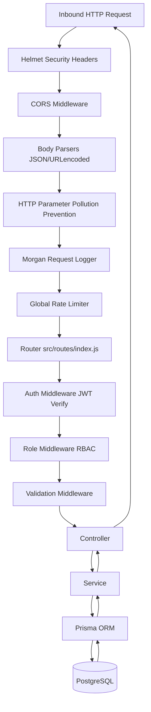

# ServiceHub Backend Architecture

## Architecture Overview
ServiceHub follows a layered MVC-like architecture with strict separation of concerns:

```text
server.js           — Process entry point, HTTP server, graceful shutdown, signal handling
src/app.js          — Express factory, middleware pipeline, route mounting
src/config/         — Environment, Prisma client, JWT constants, CORS, Swagger
src/middleware/     — Auth, RBAC, validation, rate limiting, error handling, logging
src/routes/         — Central route registry (index.js mounts all modules)
src/modules/        — Feature modules (controller → service → Prisma)
src/validations/    — express-validator schemas per module
src/utils/          — ApiResponse, AppError, logger, JWT, password, pagination, sanitize
src/errors/         — Domain-specific error types
```

## Request Lifecycle



## Module Structure
Each module follows: `controller.js` → `service.js` → (optional) additional services.
Controllers are thin: they extract request data, call the service, and return an `ApiResponse`.
Services contain all business logic, data validation, and Prisma interactions.

## Key Design Decisions
1. **Single PrismaClient per module** — each service instantiates its own PrismaClient. In production, replace with a shared singleton from `src/config/prisma.js`.
2. **UUID primary keys for users** — prevents ID enumeration attacks on user resources.
3. **Integer PKs for all other tables** — lighter joins, simpler foreign keys.
4. **Atomic wallet operations** — uses Prisma increment/decrement inside transactions; bounds checked AFTER decrement to prevent TOCTOU race conditions.
5. **Atomic coupon enforcement** — usageCount incremented inside transaction, then checked against maxUsage; rolls back if exceeded.
6. **BookingStatusHistory** — every status transition writes an immutable audit entry in the same transaction as the status update.
7. **Timing attack mitigation** — login always runs `bcrypt.compare()` even when user is not found (dummy hash fallback).
8. **Input sanitization** — plain-text fields pass through `sanitizePlainText()` which strips HTML tags without escaping (prevents data corruption for mobile clients).
9. **Pagination utility** — `getPaginationOptions()` + `formatPaginatedResponse()` applied consistently across all collection endpoints.
10. **express-async-errors** — wraps all async route handlers; uncaught async errors flow to the global error handler.

## Security Layers
1. **Helmet** — 14 security headers.
2. **CORS** — allowlist of origins.
3. **Rate limiting** — global (100 req/15min) + auth-specific stricter limits.
4. **HPP** — prevents duplicate query parameter attacks.
5. **Input validation** — express-validator on every mutating endpoint.
6. **Input sanitization** — XSS mitigation on free-text fields.
7. **JWT authentication** — HS256, exp + sig validation on every protected route.
8. **RBAC** — role.middleware enforces per-endpoint role requirements.
9. **User status check** — suspended/banned users rejected on every request.
10. **Bcrypt** — SALT_ROUNDS=12 for password hashing.
11. **Timing attack mitigation** — constant-time login responses.

## Database Design Principles
- All monetary values: `Decimal(10,2)`
- User IDs: `UUID` (prevents enumeration)
- All other IDs: auto-increment integer
- Immutable audit tables (`BookingStatusHistory`, `WalletTransaction`) have no `updatedAt`
- `snake_case` DB names via `@map/@@map`; `PascalCase` Prisma model names
- Cascade behaviors explicitly chosen per relationship semantics
